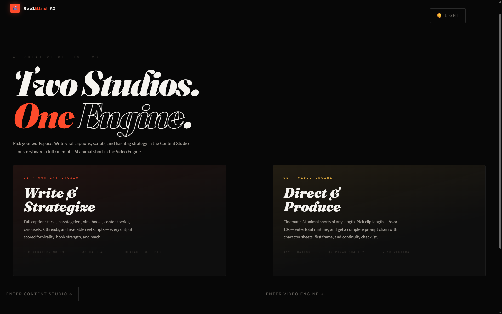
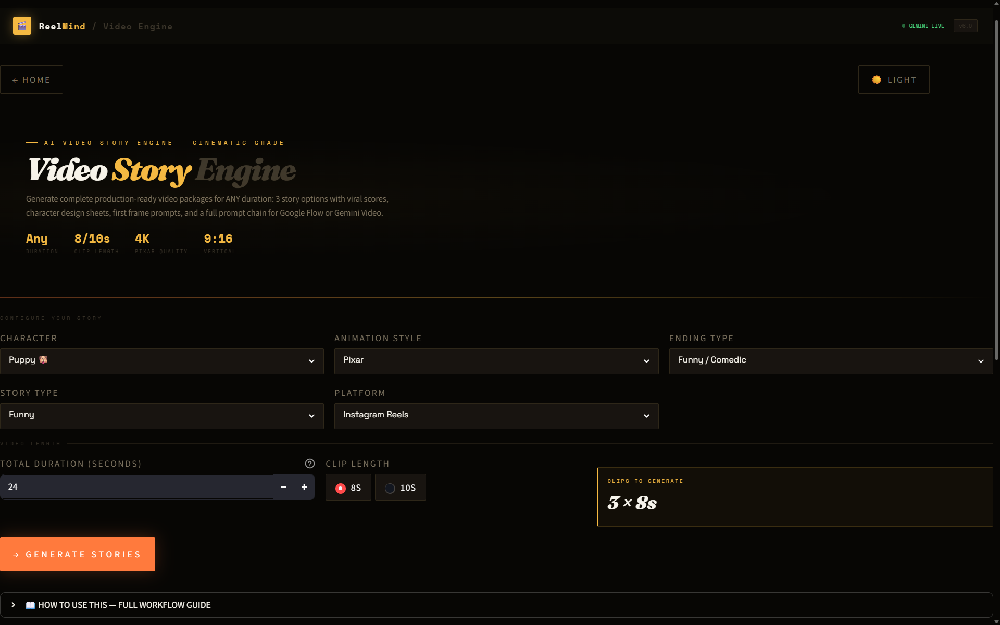
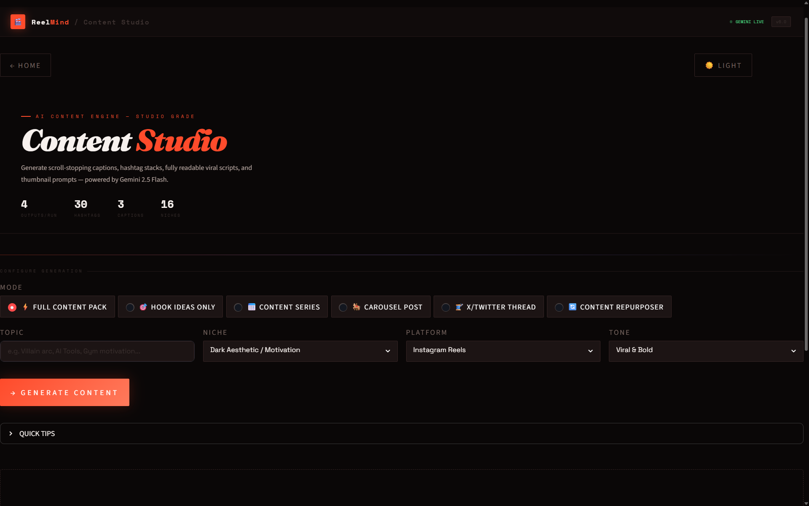
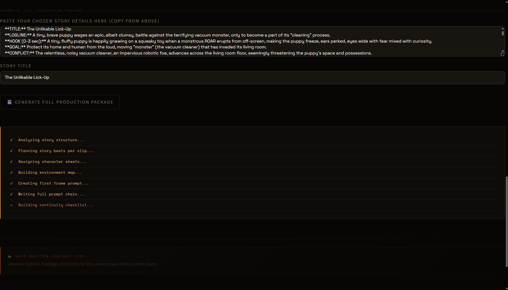
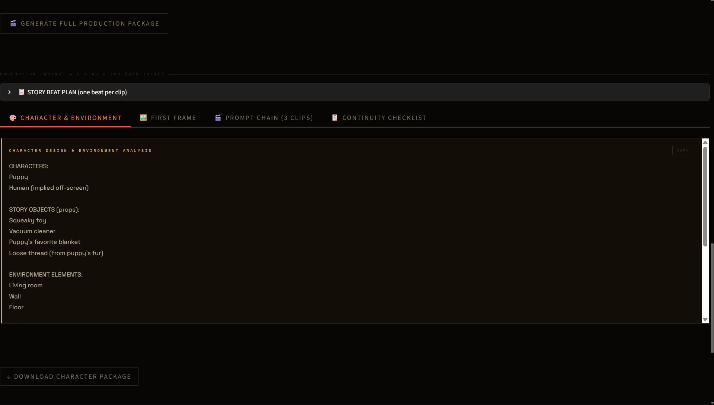

<div align="center">

# 🎬 Artifitech

### AI-Powered Content & Video Generation Studio

Generate viral social media content, cinematic AI video prompt chains, character sheets, first-frame prompts, and complete production packages using **Google Gemini 2.5 Flash**.

Built with ❤️ using **Python**, **Streamlit**, and **Gemini AI**.

---


</div>

---

# ✨ Overview

Artifitech is an AI-powered creative suite designed for creators, filmmakers, and social media professionals.

Instead of generating a single prompt, Artifitech builds an entire production workflow—from story generation to continuity management—allowing users to create cinematic AI videos with consistent characters and professional storytelling.

The application also includes a complete Content Studio for captions, hashtags, scripts, and social media optimization.

---

# 🚀 Features

## 🎥 Video Engine

✔ Generate 3 viral story concepts

✔ AI story analysis

✔ Character Sheet Generator

✔ Environment Design

✔ First Frame Prompt

✔ Story Beat Planner

✔ Multi-Prompt Chain Generator

✔ Production Continuity Checklist

✔ 8s / 10s cinematic clip workflow

✔ Optimized for Google Flow & Gemini Video

---

## 📝 Content Studio

Generate:

- Viral Hooks
- Captions
- Scripts
- 30 Hashtags
- Content Series
- Carousel Ideas
- Twitter/X Threads
- Content Repurposing Packs

---

## 🎨 Premium UI

- Dark luxury interface
- Cinematic typography
- Responsive layout
- Interactive workflow
- Production dashboard
- Real-time Gemini generation
- Light/Dark mode

---

# 🧠 Workflow

```text
User Input
      │
      ▼
Story Generation
      │
      ▼
Story Selection
      │
      ▼
Character Sheet
      │
      ▼
Environment Design
      │
      ▼
First Frame Prompt
      │
      ▼
Prompt Chain
      │
      ▼
Continuity Checklist
      │
      ▼
Production Ready Package
```

---

# 🛠 Tech Stack

| Technology | Purpose |
|------------|---------|
| Python | Backend |
| Streamlit | Web Interface |
| Google Gemini 2.5 Flash | AI Generation |
| HTML/CSS | Custom UI |
| Session State | Navigation |
| dotenv | API Security |

---

# 📂 Project Structure

```
Artifitech
│
├── app.py
├── gemini_helper.py
├── requirements.txt
├── .gitignore
└── README.md
```

---

# ⚙ Installation

Clone the repository

```bash
git clone https://github.com/Satvik-D-12/Artifitech.git
```

Move into the project

```bash
cd Artifitech
```

Install dependencies

```bash
pip install -r requirements.txt
```

Create a `.env` file

```env
GEMINI_API_KEY=YOUR_API_KEY
```

Run the application

```bash
streamlit run app.py
```

---

# 📸 Screenshots

## 🏠 Home



## 🎬 Video Story Engine



## ✍️ Content Studio



## 🎥 Production Package



## 🎨 Character & Environment Package



---

# 🎯 Future Roadmap

- Image Generation
- AI Voiceovers
- Video Preview
- Multi-language Support
- Export as PDF
- Team Collaboration
- Project Saving
- Cloud Deployment

---

# 🤝 Contributing

Contributions are welcome.

Feel free to fork this repository, create a feature branch, and submit a Pull Request.

---

# 👨‍💻 Author

**Satvik Sharma**

AI • Python • Generative AI • UI/UX

GitHub

https://github.com/Satvik-D-12

---

# ⭐ Support

If you found this project useful, consider giving it a ⭐ on GitHub.

It helps others discover the project and motivates future development.

---

<div align="center">

### Built with ❤️ by Satvik Sharma

**Artifitech • AI Content Studio • Gemini Powered**

</div>
